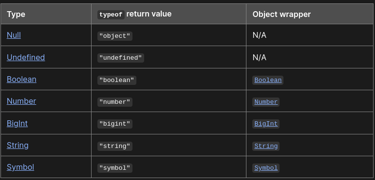

```
What is JS and Purpose of it?

JavaScript is a scripting or programming language that allows you to implement complex features on web pages — every time a web page does more than just sit there and display static information for you to look at — displaying timely content updates, interactive maps, animated 2D/3D graphics, scrolling video jukeboxes, etc. — you can bet that JavaScript is probably involved. It is the third layer of the layer cake of standard web technologies

```

```
What is execution context in JS?
everything happens inside execution context in javascript.

Execution context has two parts: 
1. Memory component aka variable environment: all the variables and functions are stored as key value pairs
2. Code component aka thread of execution
javascript is a synchronous singl thresded language. one command at a time and in a speciific order.

```

```
what happens when you run a javascript program? Or how js program is executed?
phase - 1: global execution context is created: memory creation phase - variable memory is allocated and undefined value is assigned to it.
function is saved with the whole code. when function is called a new local execution context is created and two phases of execution context happens. When it ends / returns the control to the where it was called from, the execution context is deleted.

phase 2: code is executed line by line. 


everything is managed in call stack. global execution context is in the bottom of the stack. whenever a function is invoked or local execution context is created it is put inside the stack and is cleared when its execution is completed.

when whole program is done or execution completes, the global execution context is deleted as well and the call stack is empty.
call stack maintains the execution of execution contexts.

call stack is also known by many names -> execution context stack, prog stack, control stack, runtime stack, machine stack etc.

```

```
The scope chain and lexical environment: 


```

```
Temporal Dead Zone: 
teporal dead zone is the time between the let or const is defined and being initialised. 
Let and const are also hoisted in javascript but they hoisted differently than var.  
they are being in temporal zone before initialization.
They cannot be accessed in global execution context/scope or using window or this. 
best practice is to move our declaration and initialisation on the top of the page to shrink the temporal dead zone to zero.

```
```
Block scope and shadowing:
block is defined by {} 'curly braces ' also known as compound statements. we compound statements in one place when we need to write multiple statements.

Block scope:  what all variables and functions we can access inside the block. 
They will be hoisted in block scope and not in global scope. 
if var, let and const all are defined inside {} or block. var is accessed inside global scope but let and const are not.
which is why let and const are called block scoped.
block follows lexical scope chaining if we want to access any values.

Shadowing: 
we can redeclare a variable inside a scope and it will overwrite temporarily its value for computation inside the scope.
let and const can be shadowed as well.


```

```
What are Data types in JS

JavaScript has 8 Datatypes
1. String
2. Number
3. Bigint
4. Boolean
5. Undefined
6. Null
7. Symbol
8. Object


The Object Datatype
The object data type can contain:

1. An object
2. An array
3. A date
```


### Closure 
A closure is the combination of a function bundled together (enclosed) with references to its surrounding state (the lexical environment). In other words, a closure gives you access to an outer function's scope from an inner function. In JavaScript, closures are created every time a function is created, at function creation time.
```
Explain Closures, Why do we need it 
A closure is a feature in JavaScript that allows a function to access variables outside of its own scope. 
In other words, a closure "closes over" or captures the variables that are in the surrounding environment, 
so that the function can use them even if they would otherwise be out of scope.


```
What is var , let and Const 

Explain Diff btw number data type and BigInt

Explain about Control statement and diff btween if else if and switch 

What is Object and Array

Explore All Array Methods and String Methods 

Diff between forEach() Map() and filter() 

Diff between slice and splice 

Diff btw == and === 

What is for..in and for.. of 

What is DOM and DOM Manipulation 

What is call apply bind 

What is Promise and Explain Promise 

What is Promise Chain

Drawback of Callbacks and what is callback chain 


Explain Fetch

Why we need to handle then() two times in fetch 

What is OOPs and Explain its Features

What is diff btw spread OPerator and rest Parameter 

Explain about this keyword in JS

Explain Prototype 

What is event 

Explain Event Propagation 

Explain diff btween Event Bubbling and Event Capturing

How can we restrict Event Bubbling and Event Capturng behaviour 

What is aync await 

In how many ways we can handle Promise  

Why do we need Promise 

What are the states of Promise Object 

What is Generator function in JS 

What is diff between normal function and arrow function 

How to compare Object and How to find the Object is empty or not 

What is Set 

SetTimeout and setInterval

What is Browser Object Model (BOM)

Explain Storages of Browser

Regular Expressions 

What is Hositing and Shadowing

Diff between var, let and Const 

Explain Module Concept in JS 

Debouncing

Throttling

Currying

Async vs defer
